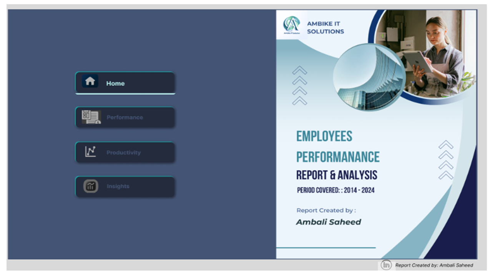
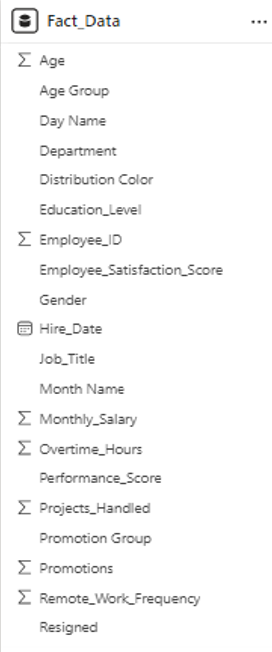
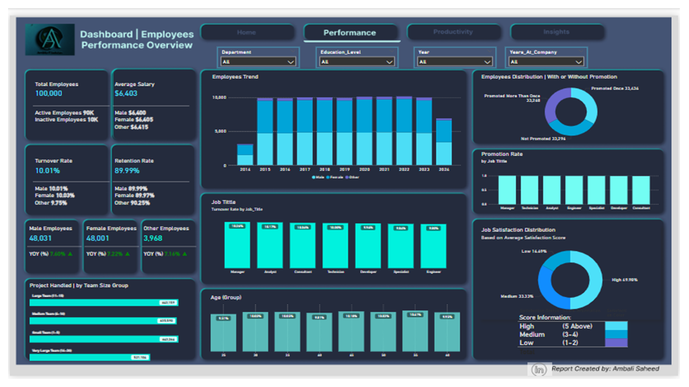
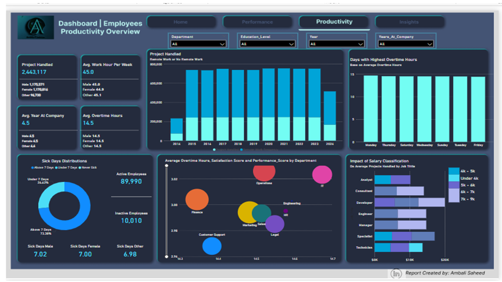
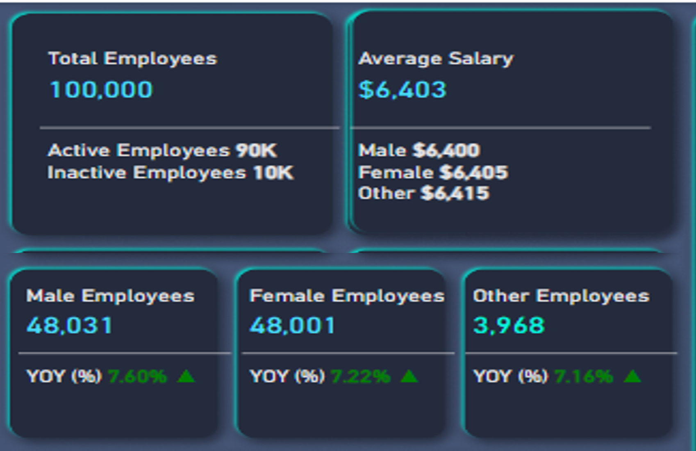
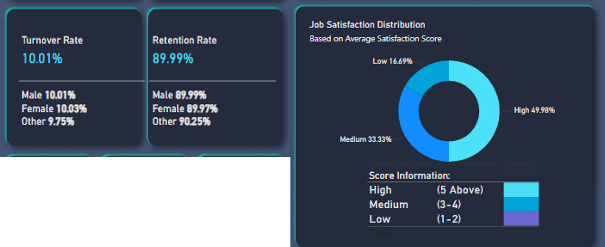
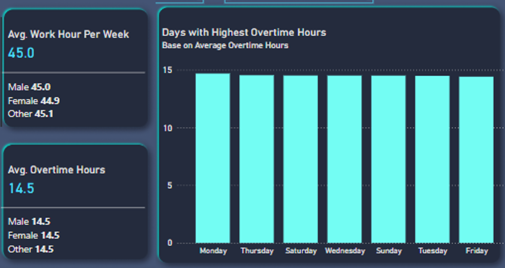
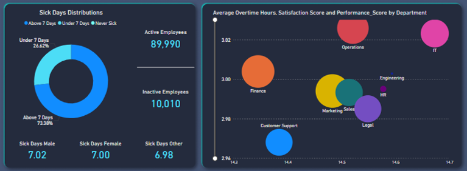

# Employees-Performance-Productivity-Report-and-Analysis

## Employees Performance & Productivity Report & Analysis

 

## Introduction

This is an overview of Ambike IT Solutions key employee performance metrics drawn from a dataset of 100,000 employees. I will explore the current distribution between active and inactive employees, analyze satisfaction rates, turnover, and key demographic breakdowns. These metrics are crucial for understanding workforce stability and identifying areas for improvement in employee engagement and retention. I will cover a range of KPIs including average salaries, project handled, promotion rate, and job satisfaction scores across different demographics. This data offers actionable insights for optimizing HR policies and enhancing employee experience. Starting with an overall snapshot, we will then dive into specific areas like job satisfaction, productivity, and retention rates to better understand the dynamics of employee performance and the implications for organizational growth.

The Report consists of Three pages:
1.	Home Page
2.	Performance Overview
3.	Productivity Overview

Power BI Concepts Applied:
•	DAX Concepts: Calculated Column, Customs Column, Measures & Calculations.

## Problem Statement

To analyze and visualize employee’s performance and productivity. The following questions are answered:
•	- Employees demographics overview.
•	- Job satisfaction and retention insights.
•	- Salary and job satisfaction correlation.
•	- Productivity and work hours analysis.
•	- Sick days and overtime impact.
•	- Promotion and performance trends.

## Data Sourcing

The data was provided by ZoomChart in Excel format for the October 2024 Power BI challenge for (Ambike IT Solutions). I downloaded the dataset and extracted it into Power Query for cleaning, Power BI for analysis, and visualization.

I loaded the dataset and examined its structure, checked for missing values through data distribution and profiling, and explored unique values in categorical columns to gain a preliminary understanding of the dataset. 

The dataset contains only 1 sheet/table:

**Structure:** The dataset has a total number of 100,000 rows and 20 columns.

**Data Types:** The columns' data types are divided into different categories, such as text, numbers, amounts, and dates.

The columns Employees ID, Age, Service year, performance score, work hour, project handled, overtime, sick days, and promotion are represented as integers or numbers.

The column Salary is represented as numbers.

The column Hired date is currently stored as a text type.

## Data Transformation/Cleaning:

The data was efficiently cleaned and transformed with the Power Query Editor within Power, including some of the applied steps.

 -  Make the first row a header.
	
 -  Analytical transformation of the table: To have an idea of the total number of employees, active and inactive employees DAX on Power BI while the datatype was converted to a whole number.

 - Extract additional columns in the fact table for Age group, Satisfaction score, Team size, Sick days, and Service year for further analysis and visualization.

## Data Modelling

No modeling was required because **Fact_Data** Table is the only table available for the analysis and visualization.

## Data Analysis and Visuals

### Dashboard | Employees Performance

The above page is the Employees Performance and Overview

1.	It is observed that the Total number of Employees is 100,000 Year to date of which current active employees are 90,000 and inactive stood at 10,000 with a turnover rate of 10.01%

2.	The workforce comprises 48,031 male employees, female 48,001 whiles others 3,968.

3.	All gender groups saw growth with males at 7.60%, females at 7.22%, and others at 7.16%.

4.	Total Average Salary remains consistent across gender groups while average salary year to date is $6,403 of which 2019 saw the highest average salary of $6415. Satisfaction levels categorized by salary show a higher satisfaction with stability in compensation

5.	Employee satisfaction score range from 1 to 5 with most employees in medium satisfaction levels (Score 3-4).

6.	There is an 89.99% retention rate with slight variances: Male 89.99%, Female 89.97% other 90.25%.

7.	Turnover rate stands at 10.01% with minor gender differences: Male 10.01%, Female 10.03%, Other 9.75%.

### Dashboard | Employees Productivity

The above page is the Employees Productivity and Overview

1.	Employees work an average of 45 hours per week with a minor variation by gender.

2.	Average overtime hour stands at 14.5 per week, fairly consistent across all genders.

3.	Average sick days per year: Male 7.02, Female 7.00, Other 6.98 showing minor gender-based differences.

4.	Higher overtime hours correlate with reduced satisfaction scores, impacting the overall well-being of the employees.

5.	Employees handled a total number of 2,223,117 projects with distributions across job roles reflecting workload alignment.

#### Employees Demographics Overview

The above report presents a breakdown of employee demographics by gender and highlights growth patterns. Of the 100,000 employees, males and females each account for nearly half, with a smaller but significant representation in other gender categories. Year-over-year growth in employee numbers has been positive across all genders, showing consistent upward trends that signal organizational expansion and inclusivity. Another notable factor is salary consistency, with an average monthly salary of $6.40K across all gender identities, indicating equality in baseline compensation. This consistency in pay can be essential for employee morale and is often a marker of fair pay practices. Together, these insights help us understand the current structure and inclusivity of the workforce, as well as the organization’s commitment to equitable treatment.

#### Job Satisfaction and Retention Insights

This section examines job satisfaction and retention metrics, focusing on employee satisfaction scores and retention rates. Scores are distributed primarily in the medium range (3-4), suggesting a generally satisfied workforce but with room for improvement. The retention rate is strong at nearly 90%, with minor gender-based variations that reflect stability across demographic lines. Notably, the turnover rate aligns closely across genders, averaging around 10%. This low turnover is indicative of an organizational environment that effectively supports employee retention. Understanding these satisfaction and retention patterns enables the organization to identify areas to enhance satisfaction, which is crucial for reducing turnover and bolstering employee engagement.

#### Productivity & Work Hours Analysis

In analyzing productivity and work hours, we find that employees work an average of 45 hours per week, with slight gender-based variations that are generally insignificant. This stability in work hours helps in setting clear expectations and maintaining work-life balance. Overtime averages around 14.5 hours weekly across all demographics, which is substantial. This overtime level has a noticeable, though moderate, effect on satisfaction levels, as extended work hours can impact employee morale and productivity in the long term. Understanding the balance between productivity demands and employee satisfaction is crucial, as managing overtime could enhance overall satisfaction and efficiency within the team.

#### Average Sick Days and Overtime Satisfaction Insights

This dashboard provides insights into the relationship between overtime hours and employee well-being. Employees, on average, take 7 sick days annually, with only minor differences across genders. This low variation suggests a fairly consistent health trend across demographics. However, there is a clear impact of overtime on satisfaction and health metrics. Employees with higher overtime hours often report reduced satisfaction, which can affect both morale and overall health. Increased overtime has also shown a tendency to lead to higher sick leave, as prolonged work hours may eventually lead to burnout and other health issues. These findings emphasize the importance of managing overtime to maintain both productivity and employee health, which can enhance satisfaction in the long term.

### Conclusion and Key Insights

In this final overview, key performance indicators (KPIs) underscore essential insights: Ambike IT Solutions achieved balanced growth across genders, with a year-over-year employee increase of around 7%, reflecting inclusive hiring practices. Retention rates are high at 89.99%, and turnover is low at 10.01%, signaling effective employee engagement. The average monthly salary remains consistent at $6.40K, while work hours average 45 hours per week with an additional 14.5 hours in overtime. These metrics show a workforce with stable compensation and manageable productivity demands. Finally, the volume of projects handled is impressive, with a total of 2.44 million projects completed, demonstrating substantial output across job roles. These KPIs confirm a foundation of growth, stability, and productivity, which supports ongoing organizational success.

Thank you for following through.
